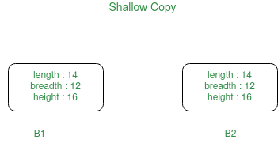
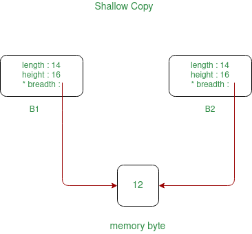
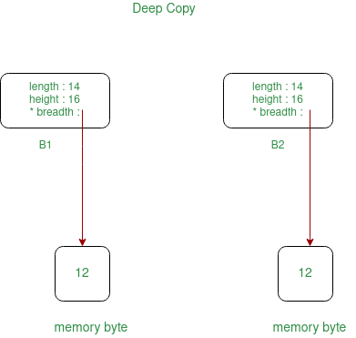

## Initialize a parameterized parent class constructor inside a child class constructor

```
class Parent {
  int x;

public:
  Parent(int i) {
    x = i;
  }
};

class Child : public Parent {
public:
  Child(int x): Parent(x) {}
};
```
---

## Shallow Copy and Deep Copy

In general, creating a copy of an object means to create an exact replica of the object having the same literal value, data type, and resources.
- Copy Constructor 
- Default assignment operator

Depending upon the resources like dynamic memory held by the object, either we need to perform Shallow Copy or Deep Copy in order to create a replica of the object. In general, if the variables of an object have been dynamically allocated, then it is required to do a Deep Copy in order to create a copy of the object.

### Shallow Copy:
In shallow copy, an object is created by simply copying the data of all variables of the original object. This works well if none of the variables of the object are defined in the heap section of memory. If some variables are dynamically allocated memory from heap section, then the copied object variable will also reference the same memory location.
This will create ambiguity and run-time errors, dangling pointer. Since both objects will reference to the same memory location, then change made by one will reflect those change in another object as well. Since we wanted to create a replica of the object, this purpose will not be filled by Shallow copy.
Note: C++ compiler implicitly creates a copy constructor and overloads assignment operator in order to perform shallow copy at compile time.






### Deep Copy:
In Deep copy, an object is created by copying data of all variables, and it also allocates similar memory resources with the same value to the object. In order to perform Deep copy, we need to explicitly define the copy constructor and assign dynamic memory as well, if required. Also, it is required to dynamically allocate memory to the variables in the other constructors, as well.




### Shallow Copy VS 	Deep copy
1.	When we create a copy of object by copying data of all member variables as it is, then it is called shallow copy 	When we create an object by copying data of another object along with the values of memory resources that reside outside the object, then it is called a deep copy
2.	A shallow copy of an object copies all of the member field values.	 Deep copy is performed by implementing our own copy constructor.
3.	In shallow copy, the two objects are not independent	It copies all fields, and makes copies of dynamically allocated memory pointed to by the fields
4.	It also creates a copy of the dynamically allocated objects	If we do not create the deep copy in a rightful way then the copy will point to the original, with disastrous consequences.